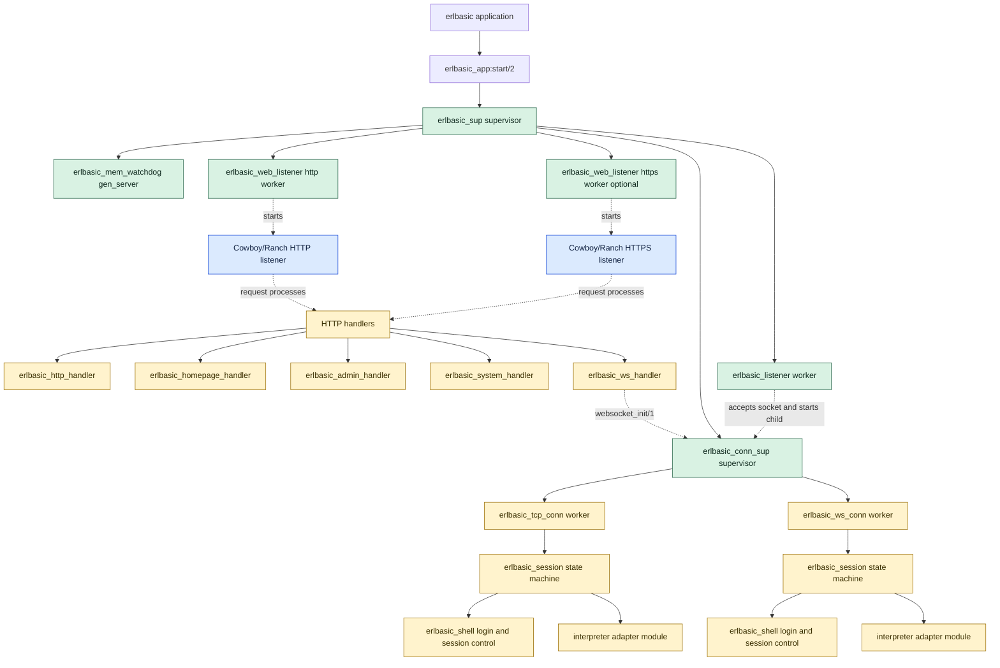

# ErlBASIC Supervision Tree

This diagram reflects the current OTP startup path in the codebase.

## What Is Directly Supervised

The `erlbasic` application starts a single top-level supervisor, `erlbasic_sup`, with a `rest_for_one` strategy. Its direct children are:

- `erlbasic_mem_watchdog`
- `erlbasic_web_listener` for HTTP
- `erlbasic_web_listener` for HTTPS when enabled
- `erlbasic_conn_sup`
- `erlbasic_listener`

Those child specs live in [src/erlbasic_sup.erl](../src/erlbasic_sup.erl).

The ordering is intentional:

- `erlbasic_listener` depends on `erlbasic_conn_sup` to start TCP session children
- the web listener workers are independent of the TCP subtree and can be restarted separately
- `rest_for_one` ensures that if `erlbasic_conn_sup` dies, the listener is torn down and restarted after it

## Web Listener Structure

HTTP and optional HTTPS are now represented in the child list via explicit `erlbasic_web_listener` workers. Each worker starts and owns one Cowboy/Ranch listener.

In practice:

- TCP listener supervision is explicit in `erlbasic_sup`
- HTTP and HTTPS startup is also explicit in `erlbasic_sup`
- the underlying Cowboy/Ranch listener trees sit below those workers
- Web requests and WebSocket connections run in Cowboy-managed processes

## Dynamic Runtime Processes

Several important processes are started dynamically under the connection supervisor rather than as static children of `erlbasic_sup`:

- each accepted TCP socket becomes a temporary child under `erlbasic_conn_sup`
- each TCP session child is now `erlbasic_tcp_conn`, which owns the raw socket loop and delegates login/session behavior to `erlbasic_session`
- each WebSocket request runs through `erlbasic_ws_handler`, which starts an `erlbasic_ws_conn` child under `erlbasic_conn_sup`
- both transport workers delegate shell/login state transitions to `erlbasic_session`, which uses `erlbasic_shell` plus the selected interpreter module

This is the main supervision improvement over the previous design:

- there is no separate linked `accept_loop` side process anymore
- TCP session roots are supervised explicitly instead of being spawned ad hoc from the listener
- TCP and WebSocket transport concerns are now separated from the shell/session state machine
- interpreter selection no longer lives in the transport layer; it is chosen by `erlbasic_shell` during login
- WebSocket session roots can also be supervised when the full application tree is running

## Source References

- [src/erlbasic_app.erl](../src/erlbasic_app.erl)
- [src/erlbasic_sup.erl](../src/erlbasic_sup.erl)
- [src/erlbasic_listener.erl](../src/erlbasic_listener.erl)
- [src/erlbasic_web_listener.erl](../src/erlbasic_web_listener.erl)
- [src/erlbasic_session.erl](../src/erlbasic_session.erl)
- [src/erlbasic_shell.erl](../src/erlbasic_shell.erl)
- [src/erlbasic_tcp_conn.erl](../src/erlbasic_tcp_conn.erl)
- [src/erlbasic_ws_conn.erl](../src/erlbasic_ws_conn.erl)
- [src/erlbasic_conn.erl](../src/erlbasic_conn.erl)
- [src/erlbasic_ws_handler.erl](../src/erlbasic_ws_handler.erl)